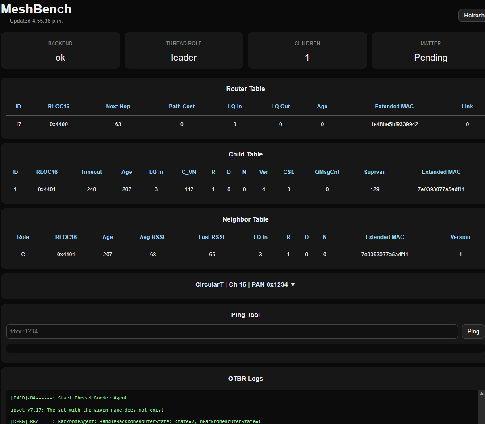

# MeshBench

An oscilloscope for your Matter + Thread network.

MeshBench focuses on direct Thread and Matter diagnostics, control, and commissioning.
Platform-specific smart-home integrations are intentionally out of scope.

## Status
Early development.

## Goals
- Local-first Matter + Thread diagnostics
- OTBR visibility
- chip-tool control surface
- Mesh topology inspection
- Future: Multi-OTBR discovery and target switching

## Prerequisites

- Python 3.11+
- Node.js + npm
- Docker
- Docker Compose (recommended)
- Access to OTBR container

## Backend Python Packages

- fastapi
- uvicorn
- python-dotenv

## Milestones
- 2026-04-21: MeshBench backend first boot successful.
- 2026-04-21: MeshBench reads live Thread state from OTBR
- 2026-04-21: Add router table endpoint from OTBR
- 2026-04-21: First MeshBench dashboard with live Thread telemetry
- 2026-04-21: Polished MeshBench dashboard UI
- 2026-04-21: OTBR logs pane added
- 2026-04-21: Move frontend and backend settings to env config
- 2026-04-23: Add child count, ping command and improve dashboard metrics
- 2026-04-23: Refine dataset viewer UX and compact dashboard layout
- 2026-04-23: First ESPHome MTD joined Thread network
- 2026-04-23: MeshBench displayed live child + neighbor telemetry